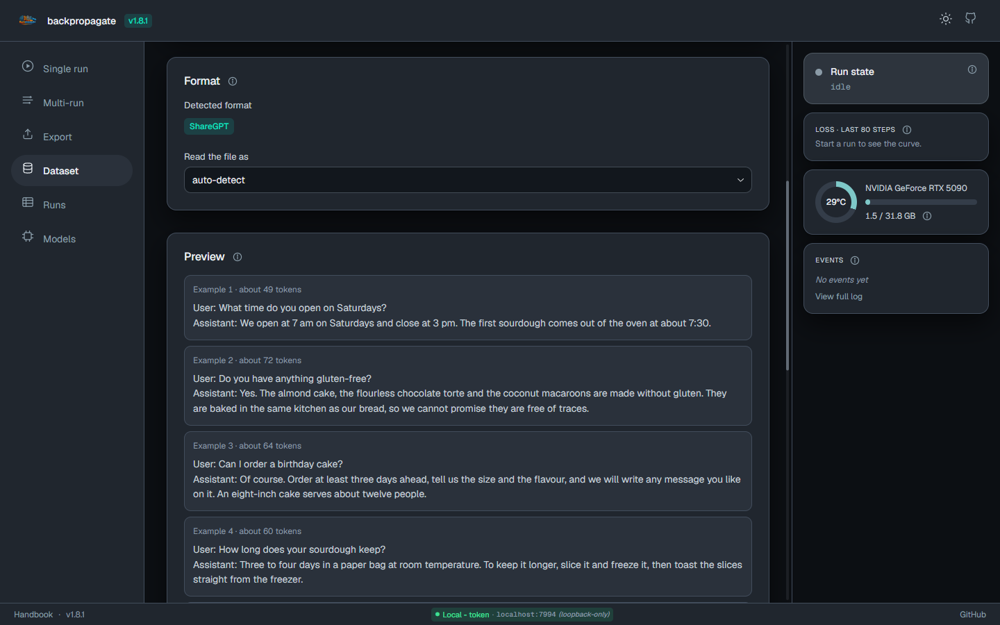
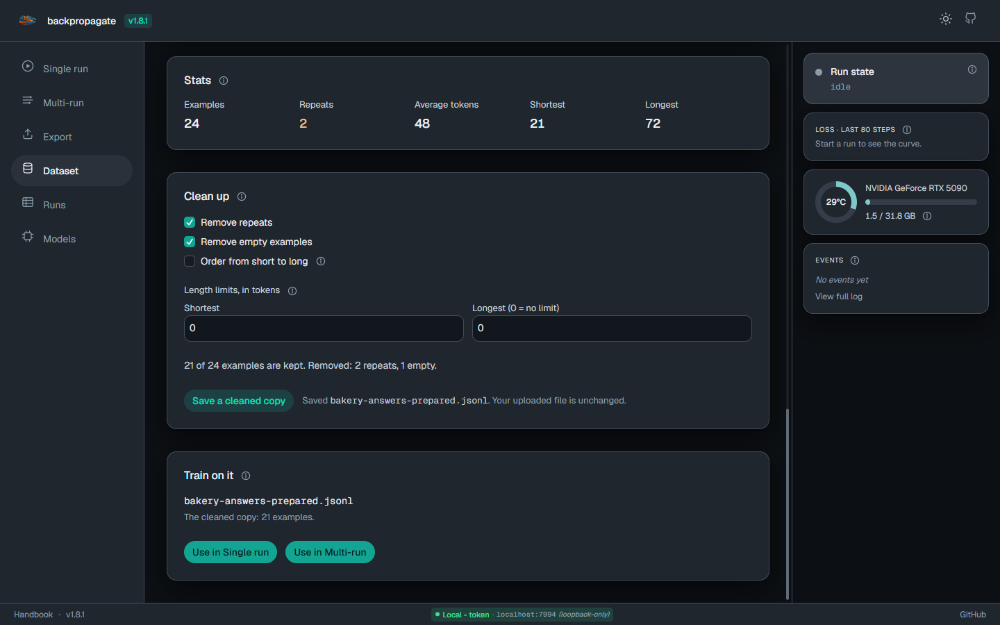
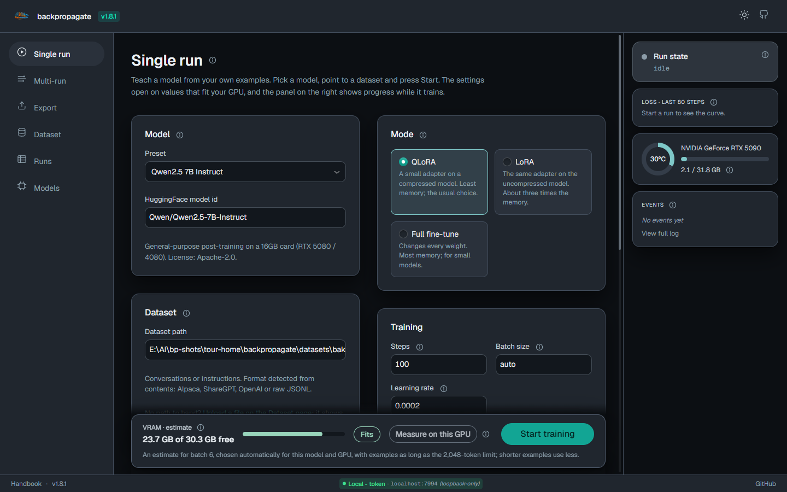
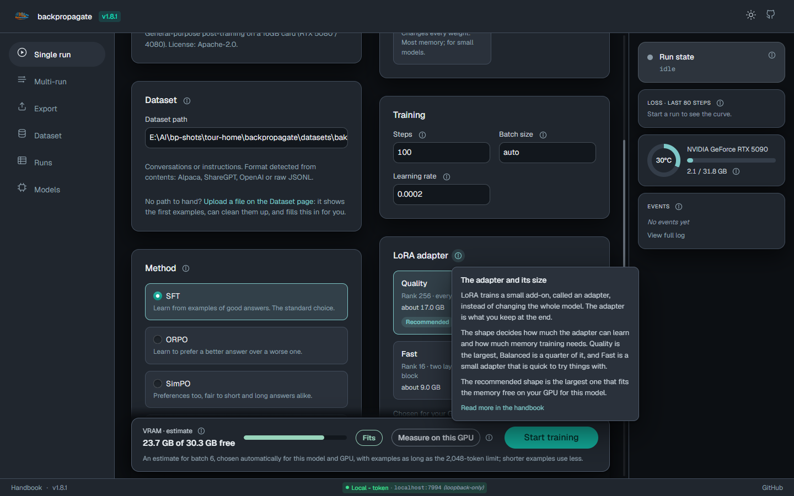
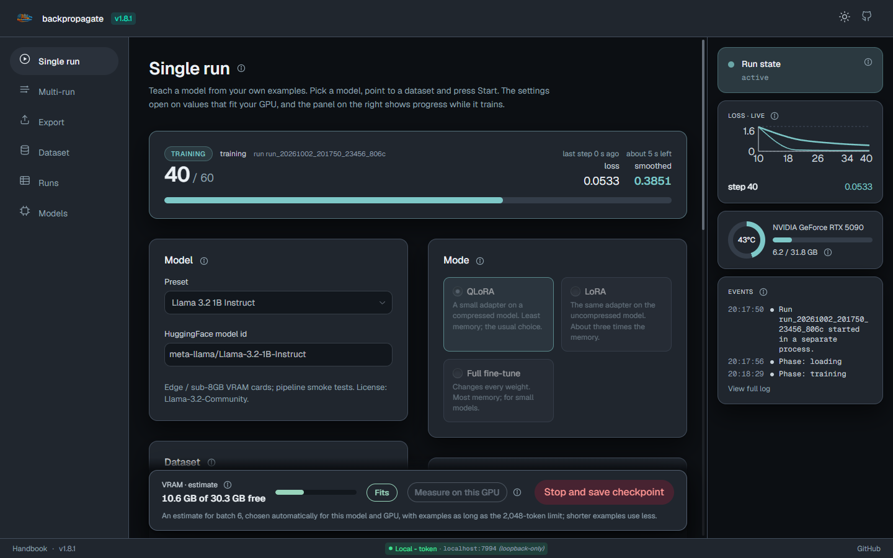
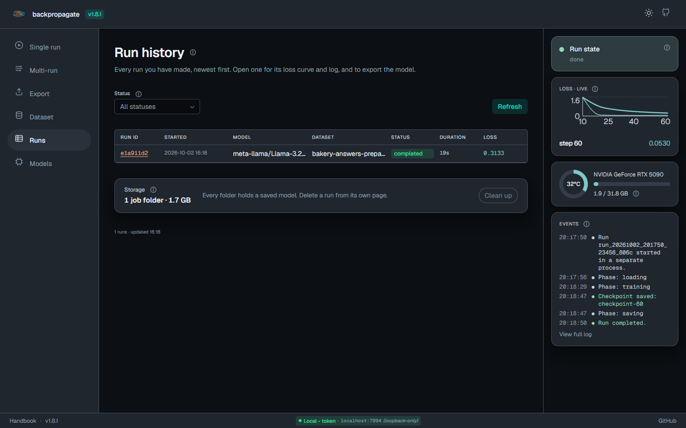
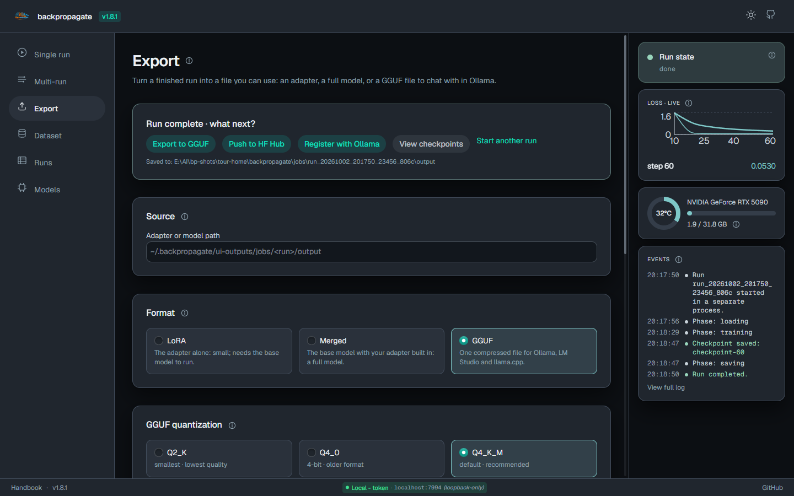

Backpropagate has a browser interface for everything the Python API and the command line do: look at a dataset, train on it, watch the run, and export the result. It runs on your own computer. Your examples and your models stay there (see [Privacy](/backpropagate/handbook/privacy/)).

:::note
This page describes version 1.8.2 and later. The screenshots are from a development build.
:::

## Start it

```bash
pip install "backpropagate[standard]"
backprop ui --open-browser
```

The command prints an address and opens it in your browser. The address carries a one-time token, so only you can use the page. To stop the UI, press Ctrl+C in the terminal.

## 1. Bring your examples

A dataset is a file of examples: a question or instruction, and the answer you want the model to learn. Drop a `.jsonl` or `.json` file on the **Dataset** page and it shows what the trainer will read: the layout it recognised, the first five examples as a conversation, how many examples there are, how many repeat, and how long they are.



**Clean up** decides what a cleaned copy leaves out: repeats, empty examples, and examples shorter or longer than a length you choose. The line under the settings says what they would keep, and it changes as you change them. **Save a cleaned copy** writes a new file; the file you uploaded is never changed. **Use in Single run** or **Use in Multi-run** puts the file in the training form and takes you there.



## 2. Set up a run

**Single run** is one training run. Pick a model from the presets (or type any Hugging Face model), check the dataset, and press **Start training**. The settings open on values that suit your graphics card, so the defaults are a reasonable first run.



Two things on this page are worth knowing about:

- **The memory estimate.** The bar along the bottom says how much GPU memory the run needs and compares it with what is free right now: **Fits**, **Tight** or **Won't fit**. If it will not fit, the page offers the change that makes it fit. **Measure on this GPU** replaces the estimate with a short real measurement.
- **The adapter size.** The LoRA adapter cards (Quality, Balanced, Fast) show how much memory each needs for the model you picked. The page opens on the largest one that fits your card.

## 3. Ask what anything means

Every section and field has an **i** next to it. Hover it, or reach it with the Tab key, and a card says what the thing is, what changing it does, and where to start. Nothing on the page assumes you already know the vocabulary.



## 4. Watch it train

A run shows its step count, the loss (a number that falls as the model learns your examples), the time left, and your GPU's memory and temperature. The panel on the right keeps the loss curve and a list of events.



**Stop and save checkpoint** stops at the next step and keeps what was learned so far. Each run is its own process, one at a time. If you reload the page or open a new tab, it picks the running job up again. Closing the UI stops the run.

## 5. Find it again

**Runs** lists every run with its real outcome: completed, stopped or failed. Open one for its loss curve, its log and its settings. The storage line says how much disk the UI's job folders use, and **Clean up** removes the folders of failed and cancelled jobs after asking. A folder that holds a saved model is never removed there.



## 6. Take the model out

**Export** turns a finished run into a file you can use. **LoRA** is the adapter alone, **Merged** is a full model with the adapter built in, and **GGUF** is one compressed file for Ollama, LM Studio and llama.cpp. With **Register with Ollama** ticked, `ollama run <name>` works as soon as the export finishes. GGUF needs llama.cpp's converter; see [Export](/backpropagate/handbook/export/).



## The other two pages

- **Multi-run** trains in several short rounds and merges the result as it goes, which helps a model keep what it learned in earlier rounds. One progress bar covers the whole sweep. See [Training](/backpropagate/handbook/training/).
- **Models** lists the models already downloaded to this computer and how much disk they use, and lets you delete one.

## Good to know

- The UI answers only on this computer unless you ask otherwise. To reach it from another machine, forward the port over SSH or use `--auth`; see [Getting Started](/backpropagate/handbook/getting-started/#web-ui) and [Security](/backpropagate/handbook/security/).
- Dataset files given to the training form must be inside the UI's own folder (`~/.backpropagate/ui-outputs` by default). Uploading on the Dataset page puts them there for you.
- Everything the UI does is also a command: `backprop train`, `backprop multi-run`, `backprop export`. See the [CLI reference](/backpropagate/handbook/cli-reference/).
